# 4. PROJETO DO DESIGN DE INTERAÇÃO

## 4.1 Personas

As personas representam usuários fictícios, baseados em traços observados no público alvo do CineMatch, e servem como guia para as decisões de design. Cada integrante do grupo definiu uma persona alinhada à proposta de recomendação personalizada de filmes e séries, cobrindo perfis distintos de consumo audiovisual (engajamento alto e baixo, diferentes faixas etárias e níveis de letramento digital).

> Os arquivos de origem em HTML+CSS estão em [`docs/personas/`](personas/). Para gerar a imagem de cada persona, abra o arquivo `.html` correspondente no navegador e capture a tela; salve o PNG em `docs/personas/img/screenshots/` mantendo o nome (`persona-1.png`, `persona-2.png`, etc.) e referencie-o nesta seção.

### Persona 1: Lucas Mendes

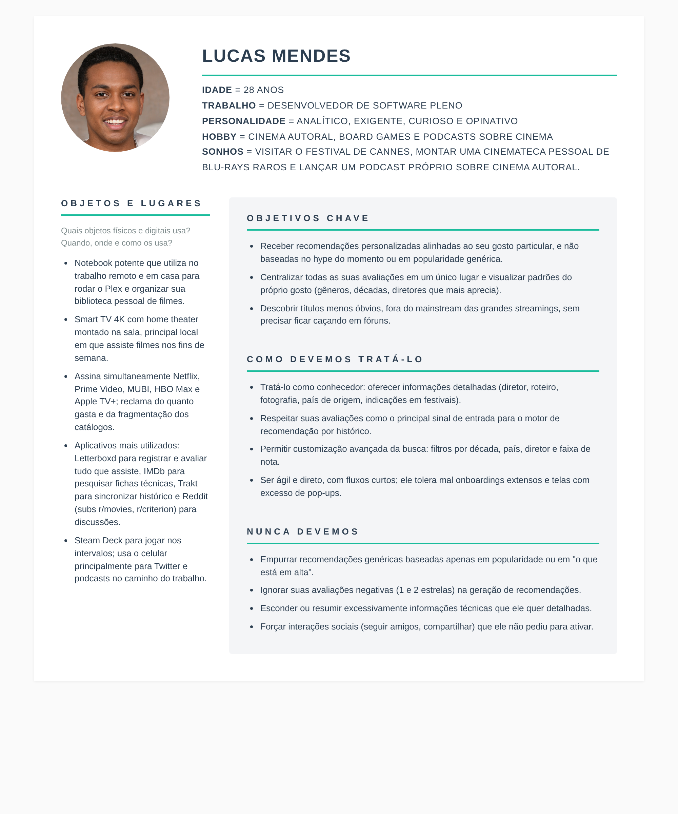

### Persona 2: Patrícia Souza

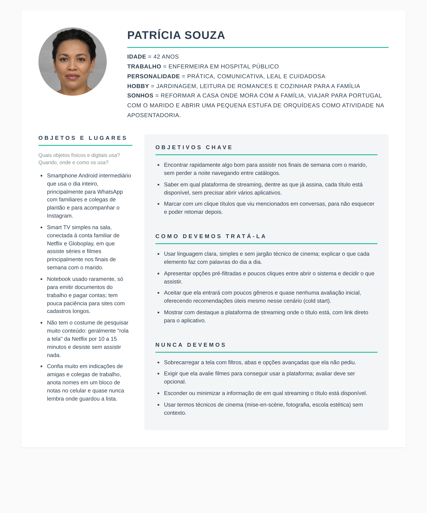

### Persona 3: a definir

> **Placeholder para o(a) integrante 2 do grupo.**
> Para preencher: copie o arquivo [`personas/persona-1.html`](personas/persona-1.html) renomeando para `persona-3.html`, edite o conteúdo (nome, idade, trabalho, personalidade, hobby, sonhos e os quatro blocos), abra no navegador, capture a tela e salve em `docs/personas/img/screenshots/persona-3.png`. Depois substitua este bloco pelo cabeçalho e pela imagem da sua persona, no mesmo formato das Personas 1 e 2.

### Persona 4: a definir

> **Placeholder para o(a) integrante 3 do grupo.** Mesmo procedimento da Persona 3, gerando `persona-4.html` e `persona-4.png`.

### Persona 5: a definir

> **Placeholder para o(a) integrante 4 do grupo.** Mesmo procedimento, gerando `persona-5.html` e `persona-5.png`.

### Persona 6: a definir

> **Placeholder para o(a) integrante 5 do grupo.** Mesmo procedimento, gerando `persona-6.html` e `persona-6.png`.

> **Sugestão de perfis complementares ainda não cobertos:** estudante adolescente (consumo via dispositivo móvel, foco em recomendações sociais), idoso (baixa proficiência digital, alta sensibilidade a navegação simples), profissional ligado a cinema ou crítica (consumo profissional, uso intenso de filtros avançados), pai ou mãe de família (consumo compartilhado, controle parental implícito por gênero).

## 4.2 Mapa de Empatia

O mapa de empatia complementa a persona ao detalhar o contexto emocional e comportamental em que ela vive. O modelo adotado utiliza sete quadrantes: (1) com quem se busca empatia, (2) o que a persona precisa fazer, (3) o que ela vê, (4) o que diz, (5) o que faz, (6) o que escuta, e (7) o que sente e pensa, dividido entre dores e ganhos.

> Mesmo fluxo de geração de imagem das personas: abrir o `.html` correspondente, capturar a tela e salvar em `docs/personas/img/screenshots/` com o nome esperado.

### Mapa de Empatia: Lucas Mendes

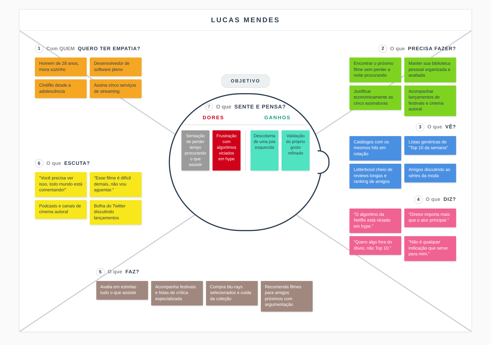

### Mapa de Empatia: Patrícia Souza

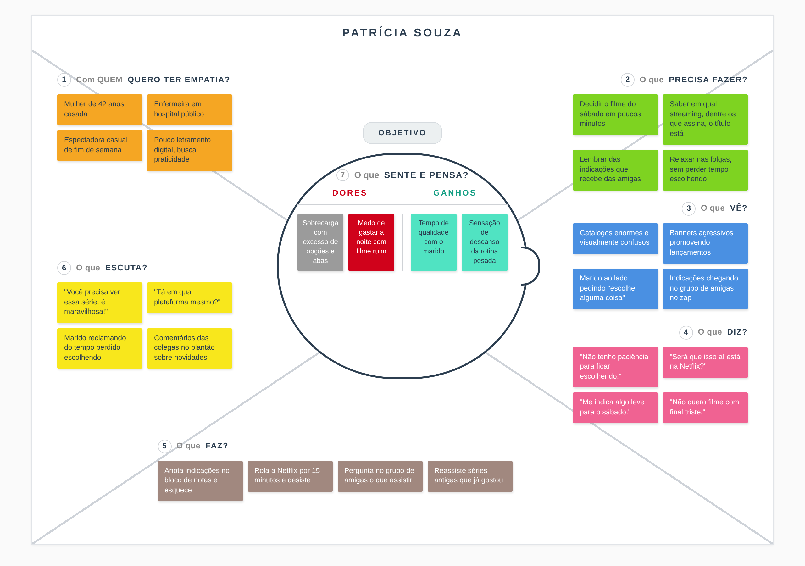

### Mapa de Empatia: persona 3 a definir

> **Placeholder para o(a) integrante 2 do grupo.** Copie [`personas/mapa-empatia-1.html`](personas/mapa-empatia-1.html) para `mapa-empatia-3.html`, ajuste o conteúdo dos sete quadrantes alinhando à sua persona, capture a tela e salve em `docs/personas/img/screenshots/mapa-empatia-3.png`.

### Mapa de Empatia: persona 4 a definir

> **Placeholder para o(a) integrante 3 do grupo.** Mesmo procedimento, gerando `mapa-empatia-4.html` e `mapa-empatia-4.png`.

### Mapa de Empatia: persona 5 a definir

> **Placeholder para o(a) integrante 4 do grupo.** Mesmo procedimento, gerando `mapa-empatia-5.html` e `mapa-empatia-5.png`.

### Mapa de Empatia: persona 6 a definir

> **Placeholder para o(a) integrante 5 do grupo.** Mesmo procedimento, gerando `mapa-empatia-6.html` e `mapa-empatia-6.png`.

## 4.3 Protótipos das Interfaces

### 4.3.1 Tela de Login: Tela por onde o usuário acessa o sistema com e-mail e senha.

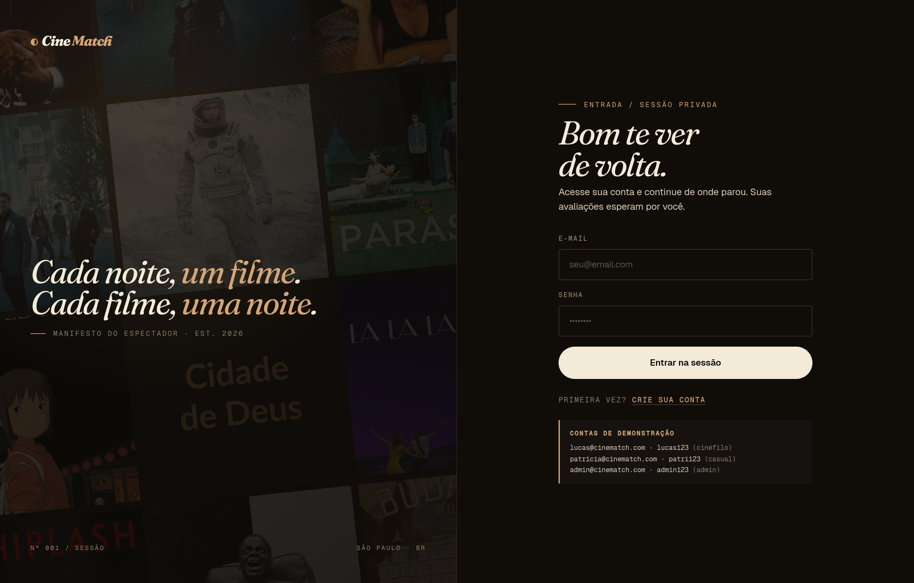

### 4.3.2 Tela de Cadastro: Tela onde o usuário cria sua conta e seleciona, no mínimo, três gêneros de preferência para o sistema iniciar as recomendações.

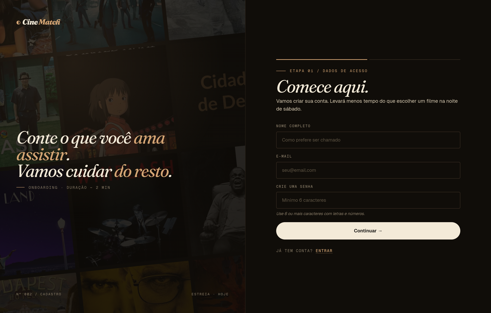

### 4.3.3 Tela Início: Tela inicial padrão visualizada pelo usuário logo após o login, exibindo título em destaque e listas de recomendações alinhadas ao seu perfil de consumo.

### 4.3.4 Tela de Busca: Tela utilizada para consulta de filmes e séries por título, com filtros avançados de tipo, gênero, ano e nota mínima.

### 4.3.5 Tela de Detalhes do Título: Tela onde o título selecionado é visualizado por completo, sendo possível avaliar, adicionar à watchlist, favoritar e consultar em quais plataformas de streaming está disponível.

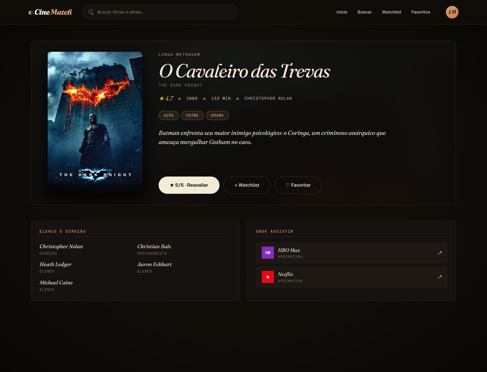

### 4.3.6 Tela Watchlist: Tela onde são listados os títulos que o usuário marcou para assistir depois, com opção de remoção.

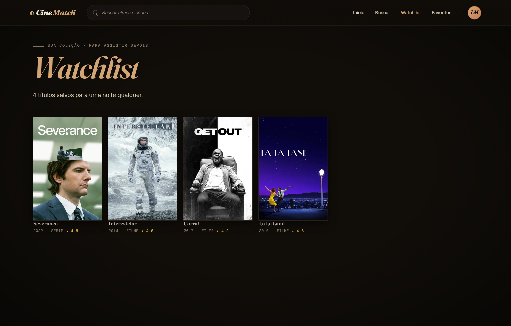

### 4.3.7 Tela Favoritos: Tela para visualização dos títulos marcados como favoritos pelo usuário.

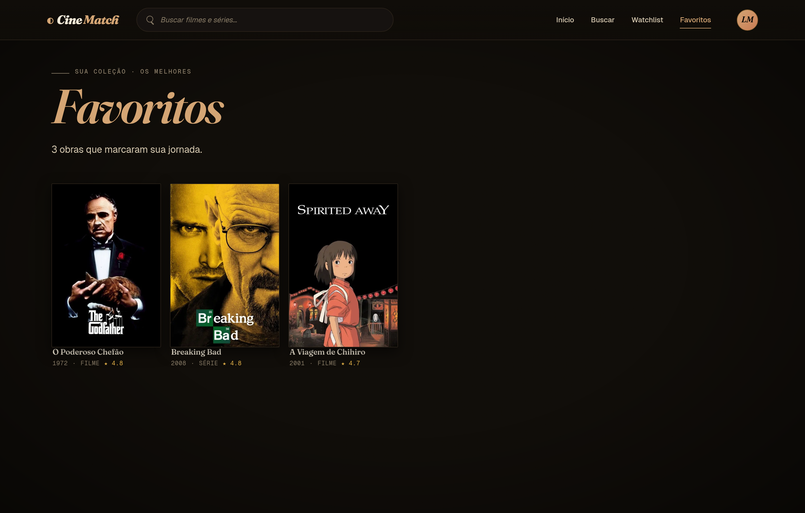

### 4.3.8 Tela Histórico: Tela onde o usuário consulta cronologicamente todos os títulos que avaliou, podendo remover entradas.

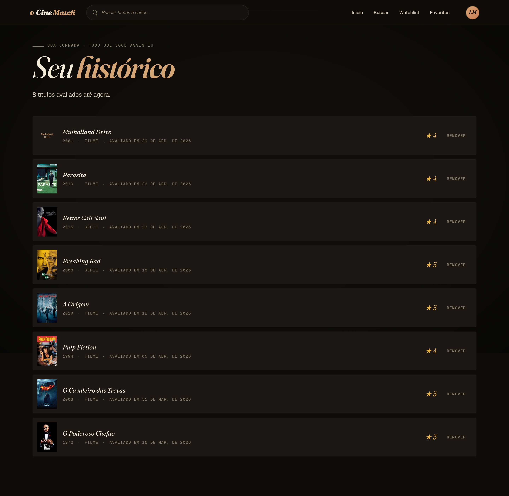

### 4.3.9 Tela Perfil: Tela funcionando como painel de controle, onde o usuário edita seu cadastro e acompanha estatísticas de avaliações, watchlist e favoritos.

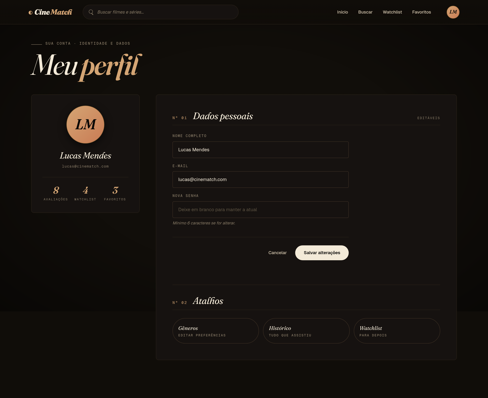

### 4.3.10 Tela Preferências de Gênero: Tela onde o usuário gerencia os gêneros que utiliza como base para as recomendações por preferência.

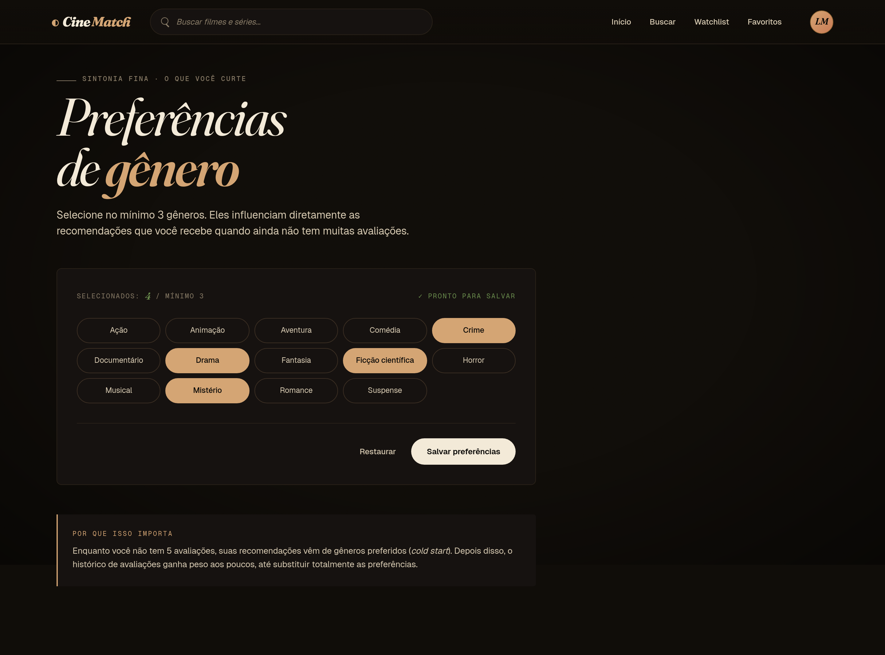

### 4.3.11 Tela Administrativa: Tela onde o administrador consulta usuários cadastrados, podendo bloquear e desbloquear contas conforme necessidade operacional.

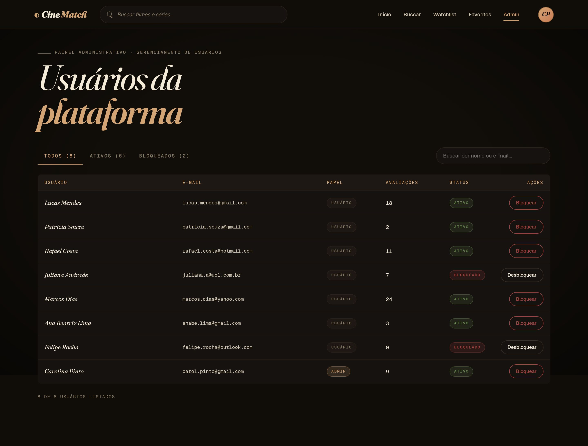

## 4.4 Testes com Protótipos

> Esta seção apresentará os testes de usabilidade aplicados pelos integrantes do grupo com usuários alinhados ao perfil das personas, incluindo o roteiro de tarefas, métricas coletadas (tempo, taxa de sucesso, número de erros, comentários) e a consolidação dos resultados com identificação de pontos de melhoria.
