# 4. PROJETO DO DESIGN DE INTERAÇÃO

## 4.1 Personas

As personas representam usuários fictícios, baseados em traços observados no público alvo do CineMatch, e servem como guia para as decisões de design. Cada integrante do grupo definiu uma persona alinhada à proposta de recomendação personalizada de filmes e séries, cobrindo perfis distintos de consumo audiovisual (engajamento alto e baixo, diferentes faixas etárias e níveis de letramento digital).

> Os arquivos de origem em HTML+CSS estão em [`docs/personas/`](personas/). Para gerar a imagem de cada persona, abra o arquivo `.html` correspondente no navegador e capture a tela; salve o PNG em `docs/personas/img/screenshots/` mantendo o nome (`persona-1.png`, `persona-2.png`, etc.) e referencie-o nesta seção.

### Persona 1: Lucas Mendes

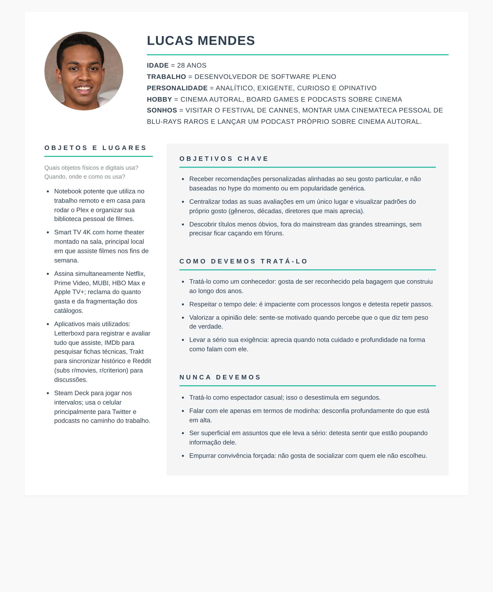

### Persona 2: Patrícia Souza

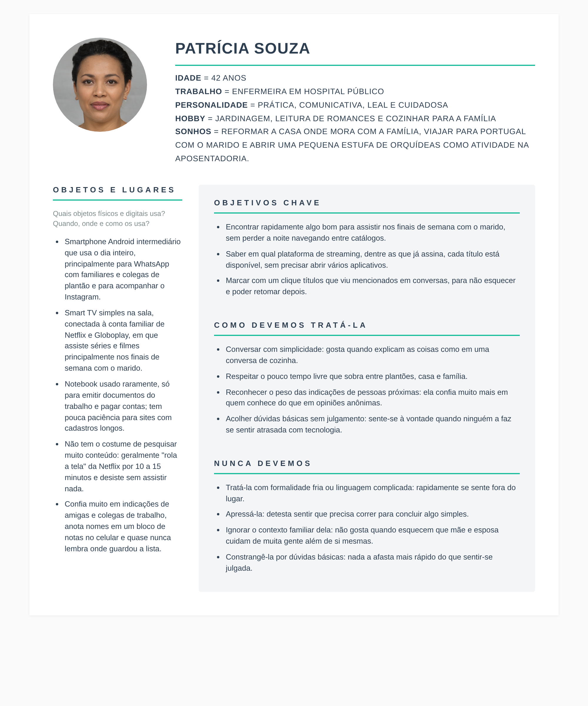

### Persona 3: Marcos Almeida

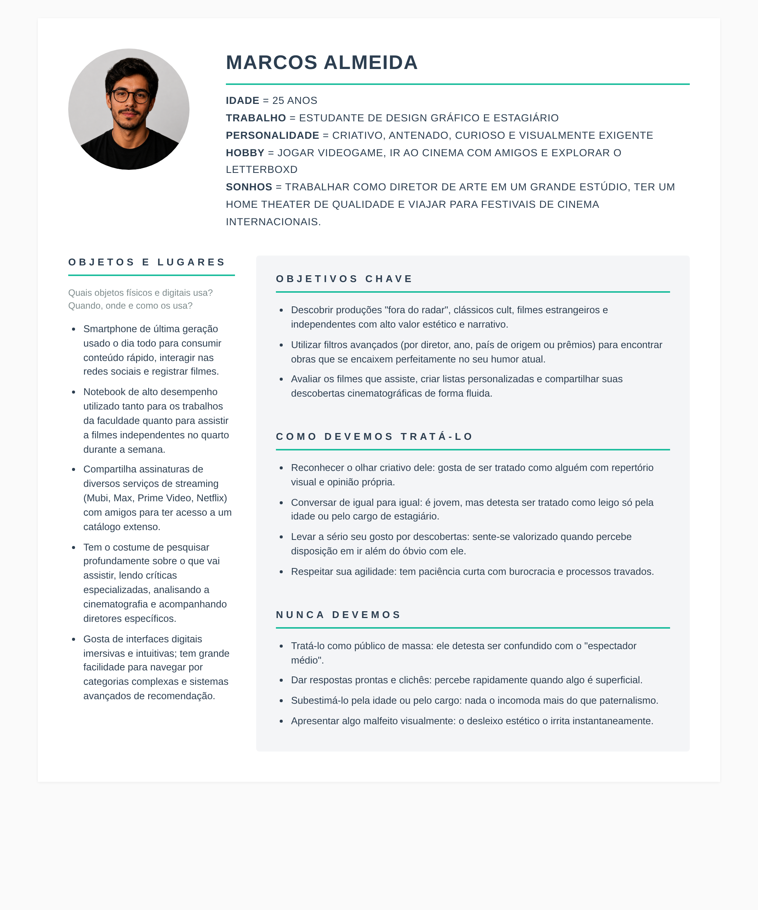

### Persona 4: a definir

> **Placeholder para o(a) integrante 3 do grupo.**
> Para preencher: copie o arquivo [`personas/persona-1.html`](personas/persona-1.html) renomeando para `persona-4.html`, edite o conteúdo (nome, idade, trabalho, personalidade, hobby, sonhos e os quatro blocos), abra no navegador, capture a tela e salve em `docs/personas/img/screenshots/persona-4.png`. Depois substitua este bloco pelo cabeçalho e pela imagem da sua persona, no mesmo formato das Personas 1, 2 e 3.

### Persona 5: a definir

> **Placeholder para o(a) integrante 4 do grupo.** Mesmo procedimento, gerando `persona-5.html` e `persona-5.png`.

### Persona 6: a definir

> **Placeholder para o(a) integrante 5 do grupo.** Mesmo procedimento, gerando `persona-6.html` e `persona-6.png`.

> **Sugestão de perfis complementares ainda não cobertos:** estudante adolescente (consumo via dispositivo móvel, foco em recomendações sociais), idoso (baixa proficiência digital, alta sensibilidade a navegação simples), profissional ligado a cinema ou crítica (consumo profissional, uso intenso de filtros avançados), pai ou mãe de família (consumo compartilhado, controle parental implícito por gênero).

## 4.2 Mapa de Empatia

O mapa de empatia complementa a persona ao detalhar o contexto emocional e comportamental em que ela vive. O modelo adotado utiliza sete quadrantes: (1) com quem se busca empatia, (2) o que a persona precisa fazer, (3) o que ela vê, (4) o que diz, (5) o que faz, (6) o que escuta, e (7) o que sente e pensa, dividido entre dores e ganhos.

> Mesmo fluxo de geração de imagem das personas: abrir o `.html` correspondente, capturar a tela e salvar em `docs/personas/img/screenshots/` com o nome esperado.

### Mapa de Empatia: Lucas Mendes

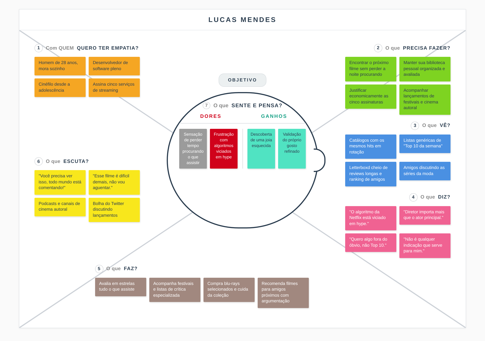

### Mapa de Empatia: Patrícia Souza

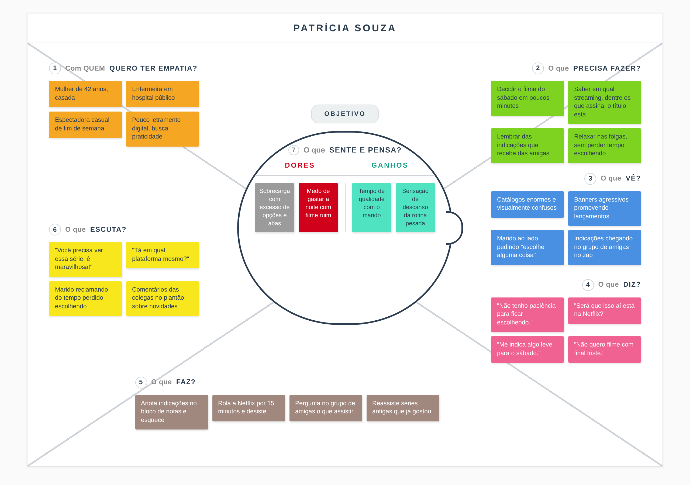

### Mapa de Empatia: persona 3 a definir

> **Placeholder para o(a) integrante 2 do grupo.** Copie [`personas/mapa-empatia-1.html`](personas/mapa-empatia-1.html) para `mapa-empatia-3.html`, ajuste o conteúdo dos sete quadrantes alinhando à sua persona, capture a tela e salve em `docs/personas/img/screenshots/mapa-empatia-3.png`.

### Mapa de Empatia: persona 4 a definir

> **Placeholder para o(a) integrante 3 do grupo.** Mesmo procedimento, gerando `mapa-empatia-4.html` e `mapa-empatia-4.png`.

### Mapa de Empatia: persona 5 a definir

> **Placeholder para o(a) integrante 4 do grupo.** Mesmo procedimento, gerando `mapa-empatia-5.html` e `mapa-empatia-5.png`.

### Mapa de Empatia: persona 6 a definir

> **Placeholder para o(a) integrante 5 do grupo.** Mesmo procedimento, gerando `mapa-empatia-6.html` e `mapa-empatia-6.png`.

## 4.3 Protótipos das Interfaces

### 4.3.1 Tela de Login

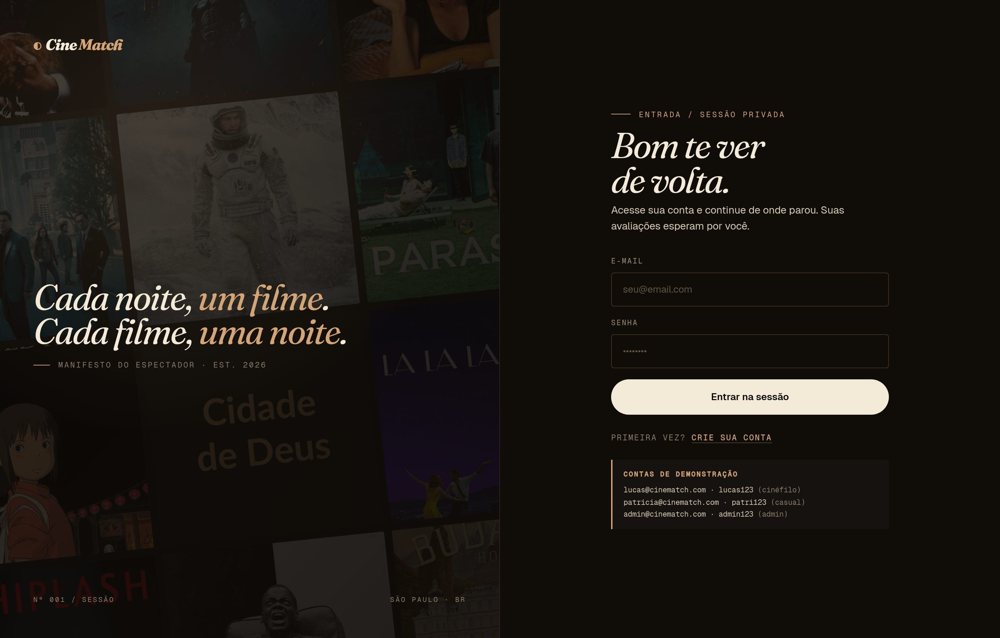

**Objetivo da Tela**: autenticar usuários já cadastrados, permitindo acesso à área logada por e-mail e senha. A tela ainda apresenta credenciais de demonstração e um link para o fluxo de cadastro, atendendo tanto quem retorna quanto quem está conhecendo o sistema.

**Princípios Gestálticos**: proximidade nos campos do formulário (e-mail, senha e botão "Entrar na sessão" agrupados em bloco único, separados visualmente da arte editorial à esquerda); figura/fundo no contraste do cartão claro do formulário sobre o fundo escuro com poster wall; similaridade nos campos de entrada com o mesmo tratamento visual; continuidade na leitura vertical, do título do produto até o botão de envio.

**Recomendações Ergonômicas**: condução, com rótulos claros acima dos campos e mensagem de erro logo abaixo; significação dos códigos no botão primário em destaque (cor amber) versus link secundário "Primeira vez?"; consistência tipográfica com o restante do produto; carga de trabalho reduzida com apenas dois campos solicitados e o uso dos atributos `autocomplete` para preenchimento automático pelo navegador.

**Regras de Ouro**: prevenção de erros através do `novalidate` controlado por JS, exibindo mensagens contextuais em vez de balões nativos; feedback informativo na área `campo-erro` quando a credencial é inválida; redução da carga de memória de curto prazo, oferecendo as credenciais de demonstração visíveis em caixa lateral; consistência com o restante do produto (mesma família tipográfica, mesmas cores e mesmo padrão de botões usados em todas as outras telas).

### 4.3.2 Tela de Cadastro

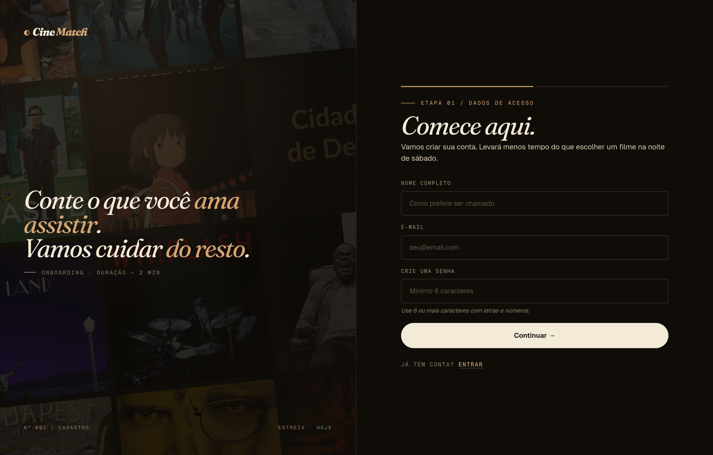

**Objetivo da Tela**: criar a conta do novo usuário em duas etapas, capturando dados básicos (nome, e-mail, senha) na primeira e, na segunda, no mínimo três gêneros de preferência que alimentarão as recomendações de cold-start.

**Princípios Gestálticos**: continuidade no indicador de duas etapas (dots no topo, com o ativo em amber e o concluído em moss); similaridade nos chips de gênero (mesma forma, mesmo tamanho, mesmo comportamento de toggle); proximidade nos botões de ação ("Voltar" e "Criar conta e entrar") agrupados na barra de ações; fechamento percebido ao completar o segundo passo, com o contador mudando de estado.

**Recomendações Ergonômicas**: condução por etapas (progressive disclosure), pedindo poucos dados por vez; controle explícito com botões "Voltar" e "Continuar" sempre visíveis; significação dos códigos no contador "Selecionados: X / mínimo 3", que troca de cor quando o critério é atendido; carga de trabalho reduzida com seleção por toque em chip, sem digitação para escolher gêneros.

**Regras de Ouro**: feedback imediato a cada chip selecionado (atualização do contador e da cor); prevenção de erros, mantendo o botão "Criar conta" desabilitado até a marca de três gêneros; reversão de ações pelo botão "Voltar", que preserva os dados já preenchidos no passo anterior; redução da carga de memória de curto prazo, deixando visível o critério mínimo na própria tela.

### 4.3.3 Tela Início

**Objetivo da Tela**: oferecer ao usuário recém-logado uma porta de entrada com recomendações personalizadas, exibindo um título em destaque (featured hero) e linhas temáticas conforme seu perfil de consumo (cold-start, transição ou histórico) e fechando com uma seção de "Em alta na crítica".

**Princípios Gestálticos**: figura/fundo no hero com backdrop borrado e gradiente sobre o pôster, fazendo o conteúdo textual sobressair; similaridade nos cards de título, todos com mesmo aspect ratio, mesma altura de tipografia e mesmo padrão de meta-informação; proximidade nas seções, cada uma com cabeçalho próprio (número, título e tag de estratégia) que delimita visualmente os blocos; continuidade na leitura em colunas dentro de cada `row-titles` com scroll horizontal e snap.

**Recomendações Ergonômicas**: condução pela saudação contextual (Boa madrugada, Bom dia, etc.) e pela numeração das seções (Nº 01, Nº 02, ...) que orienta o usuário; significação dos códigos com a tag de estratégia (ex.: "cold-start", "histórico") explicitando o porquê das recomendações; compatibilidade com a forma como serviços de streaming organizam o catálogo (linhas temáticas); carga de trabalho reduzida com ações primárias diretamente no hero ("Ver ficha" e "+ Watchlist").

**Regras de Ouro**: feedback informativo no toast exibido após adicionar à watchlist; reversão de ações via botão "Desfazer" no próprio toast; consistência visual e de comportamento com as demais telas (mesmos cards, mesmos botões); diálogos com fechamento, já que cada interação de adicionar/remover termina com a confirmação no toast.

### 4.3.4 Tela de Busca

**Objetivo da Tela**: permitir consulta avançada ao catálogo combinando texto livre com filtros por tipo (filme/série), gênero, faixa de ano e nota mínima, exibindo os resultados em grid e contagem dinâmica.

**Princípios Gestálticos**: proximidade no agrupamento dos filtros por categoria, cada um com seu rótulo e seus controles dentro do `filter-group`; similaridade nas checkboxes e nos cards de resultado; continuidade na coluna lateral fixa (sticky), que acompanha o scroll dos resultados; figura/fundo entre a sidebar com fundo neutro e o grid de resultados, mais claro.

**Recomendações Ergonômicas**: adaptabilidade pela combinação de filtros (texto, checkbox, range slider); feedback em tempo real, com a contagem "X títulos" e o texto "≥ X.X ★" recalculados a cada alteração; controle explícito no botão "Limpar filtros"; significação dos códigos no slider com `accent-color` amber, alinhado à identidade do produto.

**Regras de Ouro**: feedback informativo na contagem e no texto do filtro de nota; reversão de ações pelo "Limpar filtros"; redução da carga de memória de curto prazo, mantendo todos os filtros aplicados visíveis; prevenção de erros, com filtros que se aplicam instantaneamente, sem necessidade de submissão explícita que possa falhar.

### 4.3.5 Tela de Detalhes do Título

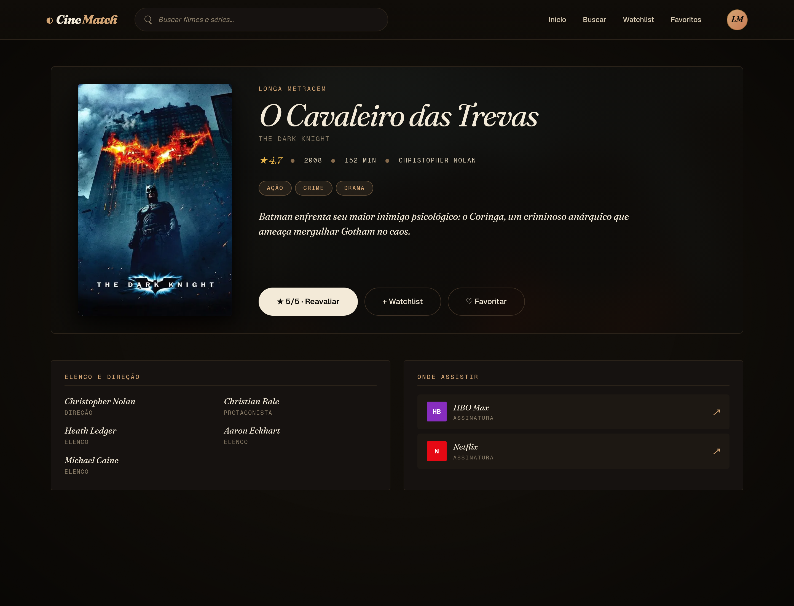

**Objetivo da Tela**: apresentar a ficha completa do título selecionado (sinopse, meta, elenco, direção e provedores de streaming) e oferecer as ações principais sobre ele: avaliar com estrelas, adicionar à watchlist e favoritar.

**Princípios Gestálticos**: figura/fundo no hero com backdrop blur e gradiente, evidenciando pôster, título e ações; proximidade entre os três botões de ação (Avaliar, Watchlist, Favoritar) na mesma linha; similaridade nas pílulas de gênero e nas linhas de provedor; continuidade na leitura vertical (hero, blocos de elenco/direção e onde assistir, dispostos em grid simétrico).

**Recomendações Ergonômicas**: condução pela hierarquia visual entre título, sinopse e ações; significação dos códigos nas estrelas (★ X/5), no coração para favoritos e no check para watchlist; controle explícito pelo modal de avaliação, em que o usuário confirma ou cancela; compatibilidade com as expectativas vindas de outras plataformas (logo do streaming, link externo abrindo em nova aba com `target="_blank"`).

**Regras de Ouro**: atalhos de teclado dentro do modal (números 1 a 5 para estrelas, ESC para fechar) com a dica "Atalho: pressione 1 a 5" exibida ao lado do picker; feedback imediato no estado dos botões ("✓ Na watchlist", "♥ Favoritado", "★ X/5 · Reavaliar"); reversão de ações pelo "Desfazer" do toast e pela própria reavaliação; diálogos com fechamento, com o modal terminando em "Confirmar" ou "Cancelar".

### 4.3.6 Tela Watchlist

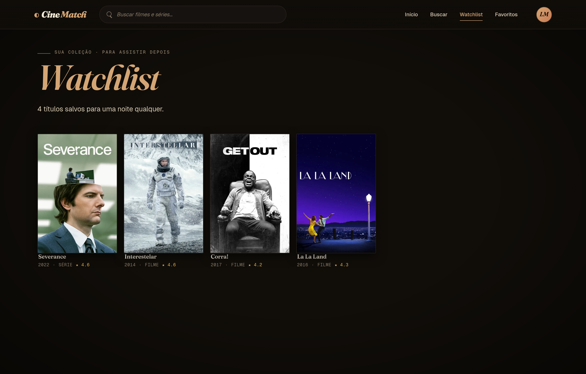

**Objetivo da Tela**: reunir, em um único lugar, os títulos que o usuário marcou para assistir depois, com possibilidade de remoção rápida e link de ida ao catálogo quando a lista está vazia.

**Princípios Gestálticos**: similaridade no grid de cards (todos com mesmo formato, mesmo padrão de meta e mesmo botão "Remover" sobreposto ao pôster); proximidade entre o pôster e o título dentro de cada card; figura/fundo no botão "Remover" com fundo translúcido sobre o pôster (`backdrop-filter: blur`); continuidade na varredura em colunas do grid `auto-fill`.

**Recomendações Ergonômicas**: condução, com lead text contextual indicando contagem ou incentivando a explorar; significação dos códigos no botão "Remover" canto superior direito, padrão repetido em outras coleções; controle explícito do usuário sobre o conteúdo da própria coleção; carga de trabalho reduzida com remoção em um único clique.

**Regras de Ouro**: empty state informativo, com ícone, título "Nada por aqui ainda", subtítulo orientador e CTA "Explorar catálogo" levando à busca; reversão de ações pelo "Desfazer" do toast após remoção; consistência com Favoritos e Histórico, que repetem o mesmo padrão de coleção; feedback informativo a cada operação.

### 4.3.7 Tela Favoritos

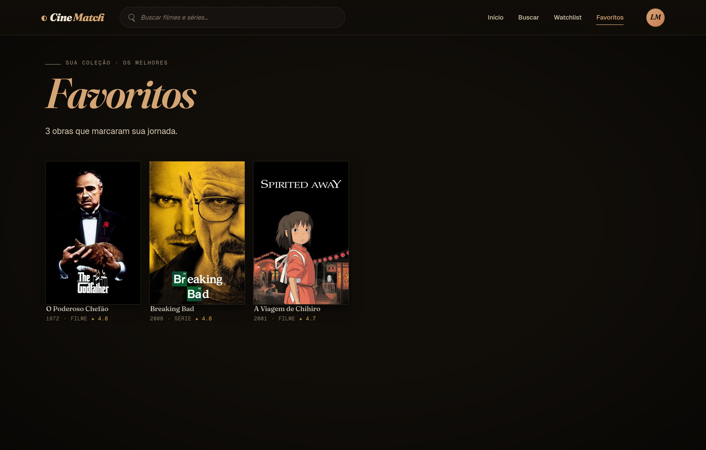

**Objetivo da Tela**: agrupar os títulos marcados como favoritos pelo usuário, com a mesma mecânica de listagem e remoção da watchlist, deixando claro que se trata de uma coleção afetiva (e não de fila de consumo).

**Princípios Gestálticos**: similaridade total com a tela de watchlist (mesmo grid, mesmo card, mesmo botão), reforçando o aprendizado; figura/fundo idêntico ao da watchlist; proximidade dos cards no grid; o que diferencia é a substituição do ícone do empty state por um coração vazio (♡), reforçando a identidade da coleção.

**Recomendações Ergonômicas**: consistência com a watchlist (mesmas posições, mesmos rótulos, mesmas ações), reduzindo o custo de aprendizado; significação dos códigos no ícone de coração, presente em todo o produto para "favoritar"; carga de trabalho reduzida pela transferência direta do conhecimento adquirido em outras coleções.

**Regras de Ouro**: consistência (a regra mais explorada nesta tela); reversão pelo "Desfazer" do toast; empty state com CTA "Voltar para o início"; feedback informativo na contagem e no toast.

### 4.3.8 Tela Histórico

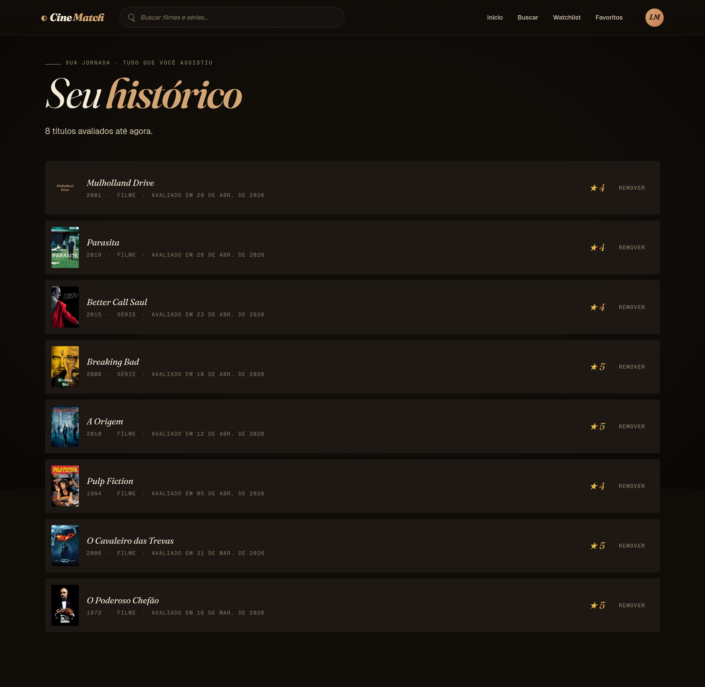

**Objetivo da Tela**: registrar cronologicamente todos os títulos que o usuário avaliou, exibindo a nota dada e a data da avaliação, com a possibilidade de remover entradas individualmente.

**Princípios Gestálticos**: continuidade na lista vertical, em que cada linha (`provider-row`) repete o mesmo ritmo: pôster mini à esquerda, título e meta no centro, rating e ação à direita; similaridade entre as linhas; proximidade entre o título do filme, o ano, o tipo e a data dentro de cada linha; figura/fundo entre o card claro de cada item e o fundo da página.

**Recomendações Ergonômicas**: condução pela ordem cronológica reversa (mais recentes em cima); significação dos códigos no rating em destaque (★ X) à direita e na data formatada em pt-BR ("Avaliado em DD MMM YYYY"); compatibilidade com a leitura natural ocidental (esquerda para a direita); carga de trabalho reduzida pelo reaproveitamento do componente `provider-row`, que o usuário já conhece da tela de Detalhes.

**Regras de Ouro**: redução da carga de memória, exibindo a data junto da avaliação; reversão pelo "Desfazer" do toast, que restaura inclusive a nota original; consistência com o padrão de remoção das outras coleções; empty state coerente, com o ícone de estrela, indicando que basta avaliar um filme para iniciar o histórico.

### 4.3.9 Tela Perfil

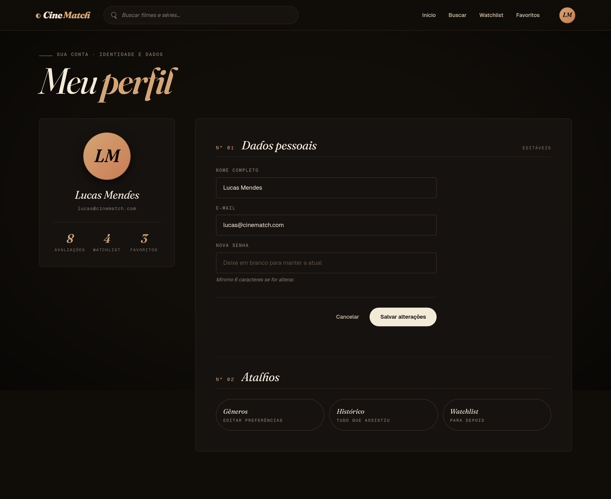

**Objetivo da Tela**: funcionar como painel de controle do usuário, permitindo edição de dados pessoais (nome, e-mail, senha), visualização de estatísticas (avaliações, watchlist, favoritos) e atalhos para gêneros, histórico e watchlist.

**Princípios Gestálticos**: proximidade na sidebar (avatar, nome, e-mail e estatísticas como bloco coeso); similaridade nas três estatísticas, dispostas em grid de três colunas com mesma tipografia; continuidade entre a sidebar à esquerda e o conteúdo à direita; figura/fundo no avatar circular com gradiente sobre o cartão claro.

**Recomendações Ergonômicas**: condução pela divisão entre "Dados pessoais" (editáveis) e "Atalhos" (navegação); controle explícito com botões "Cancelar" e "Salvar alterações"; significação dos códigos no badge "Administrador" quando o papel for admin; carga de trabalho reduzida no campo "Senha", opcional ("Mínimo 6 caracteres se for alterar").

**Regras de Ouro**: prevenção de erros, com mensagem clara sobre o opcional da senha; feedback informativo via toast ao salvar; consistência tipográfica e de componentes (mesmo `field`, mesmo padrão de cards de atalho); reversão pelo "Cancelar", que descarta alterações antes do salvamento.

### 4.3.10 Tela Preferências de Gênero

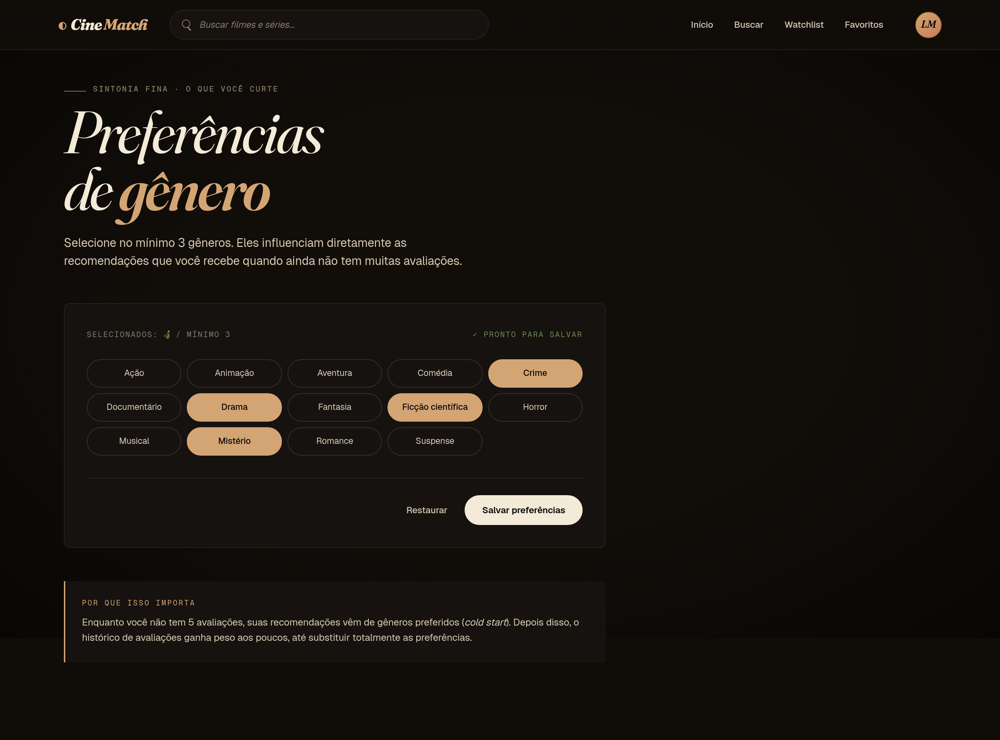

**Objetivo da Tela**: permitir que o usuário gerencie os gêneros que servem de base para as recomendações por preferência, mantendo a regra de mínimo de três e explicando, de forma educativa, por que isso impacta a experiência.

**Princípios Gestálticos**: similaridade entre todos os chips de gênero, com a mesma forma, mesmo tamanho e mesma transição entre os estados "selecionado" e "não selecionado"; proximidade dos chips no grid e do contador acima deles; figura/fundo no info box com borda lateral amber, separando-o visualmente do bloco principal; fechamento percebido quando o contador atinge três e muda para verde.

**Recomendações Ergonômicas**: condução pela mensagem-lead que explica o propósito; significação dos códigos no contador, que alterna entre "faltam N" (em tom muted) e "✓ pronto para salvar" (em verde moss); controle explícito pelos botões "Restaurar" e "Salvar preferências"; carga de trabalho reduzida pela seleção por toque em chip, sem digitação.

**Regras de Ouro**: prevenção de erros, com o botão "Salvar preferências" desabilitado enquanto a regra dos três não é cumprida; feedback informativo no contador em tempo real; reversão pelo botão "Restaurar"; redução da carga de memória, deixando o critério mínimo sempre visível no contador.

### 4.3.11 Tela Administrativa

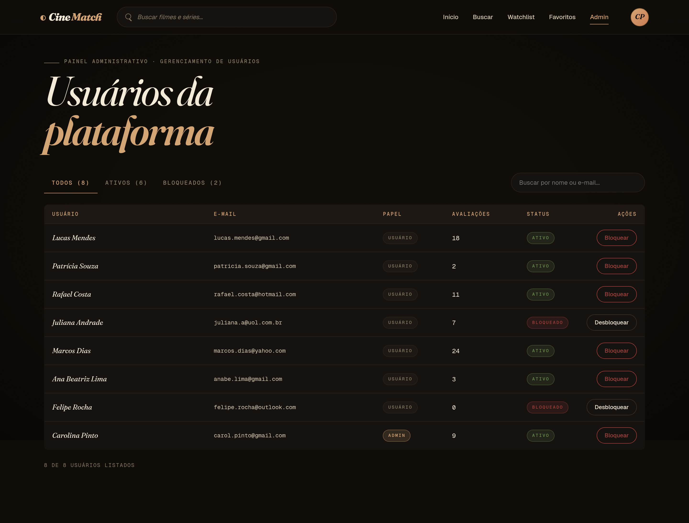

**Objetivo da Tela**: oferecer ao administrador uma visão consolidada dos usuários da plataforma, com filtros por status (Todos, Ativos, Bloqueados) e busca por nome ou e-mail, permitindo bloquear ou desbloquear contas conforme necessidade operacional.

**Princípios Gestálticos**: continuidade nas linhas da tabela, todas alinhadas pelas mesmas colunas (Usuário, E-mail, Papel, Avaliações, Status, Ações); similaridade nos badges (papel e status), todos com a mesma forma de pílula em mono uppercase; proximidade entre os tabs e o campo de busca, formando uma toolbar única; figura/fundo no hover das linhas, com leve tinta amber a 4% de opacidade.

**Recomendações Ergonômicas**: condução pelos tabs com contagem dinâmica entre parênteses ("Todos (N)", "Ativos (N)", "Bloqueados (N)"); significação dos códigos nas cores dos badges (verde moss para ativo, vermelho crimson para bloqueado, amber para admin); compatibilidade com painéis administrativos típicos (tabela densa com ações inline); adaptabilidade pela combinação de filtro por aba e busca textual em tempo real.

**Regras de Ouro**: feedback informativo no rodapé "X de Y usuários listados"; reversão pelo "Desfazer" do toast após bloquear/desbloquear; prevenção de erros pelo botão "Bloquear" em destaque danger (crimson), avisando visualmente sobre a gravidade da ação; consistência com o restante do produto, reaproveitando os mesmos badges, botões e padrão de toast usados nas demais telas.

## 4.4 Testes com Protótipos

Foram realizados testes de usabilidade com usuários distintos, em que cada participante percorreu um conjunto de tarefas no protótipo (criar conta com seleção de gêneros, abrir a ficha de um título em destaque, adicionar e remover da watchlist, avaliar um filme, usar a busca com filtros, alterar preferências e remover entrada do histórico) e classificou cada operação como Fácil, Mediano ou Difícil. Os resultados estão sintetizados a seguir.

Dados do usuário 1: Cláudia Ribeiro, 45 anos, professora de ensino médio na rede estadual, casada, mãe de dois filhos. Assiste a séries e filmes nos finais de semana com a família, assina Netflix e Globoplay e tem familiaridade média com aplicativos de celular.

Resultado 1: Classificou a maior parte das tarefas como "Fácil" e duas como "Mediano". Aprovou a estética geral e a clareza dos textos, comentando que o sistema "não parecia um site complicado de cinéfilo". Encontrou facilmente o título em destaque na tela inicial e elogiou a ficha de detalhes pela quantidade de informação reunida sem poluição visual. Estranhou, no cadastro, a obrigatoriedade de selecionar três gêneros, mas reconheceu o valor depois de ver as recomendações iniciais. Não percebeu o atalho de teclado para avaliar e sugeriu que a dica "Atalho: pressione 1 a 5" ficasse mais visível. Na busca, demorou alguns segundos para entender que o controle deslizante era a nota mínima e sugeriu trocá-lo por um seletor com estrelas. Destacou positivamente o botão "Desfazer" exibido após remover algo, comentando que isso "tira o medo de errar".

Dados do usuário 2: Daniel Soares, 27 anos, designer gráfico freelancer. Cinéfilo, mantém perfil ativo no Letterboxd, assina três serviços de streaming e tem alta proficiência tanto em desktop quanto em mobile.

Resultado 2: Classificou todas as tarefas como "Fácil". Comentou que a experiência foi rápida e fluida, que a paleta funcionou bem e que a hierarquia tipográfica do hero da Home estava "bem resolvida". Aproveitou o atalho de teclado para avaliar e citou como uma diferença que percebe em poucos produtos. Apontou que a saudação contextual ("Boa noite") ficou simpática, mas pode infantilizar um produto sério sobre cinema, sugeriu deixá-la opcional. Achou que os ícones de empty state em caracteres especiais (∅, ♡, ★) parecem pouco refinados perto do restante do sistema e propôs trocá-los por SVG. Na busca, gostou da aplicação dos filtros em tempo real, mas sentiu falta de mais opções de ordenação além de "relevância" (sugeriu nota, ano e popularidade). Reforçou ao final que o produto "já está usável" e que os ajustes são de polimento.
