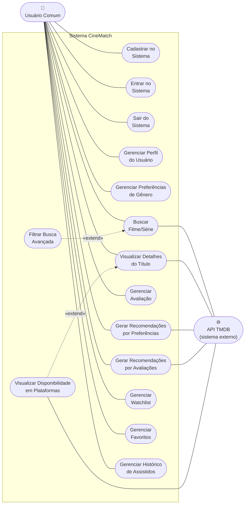
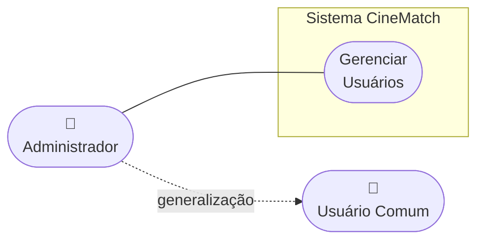
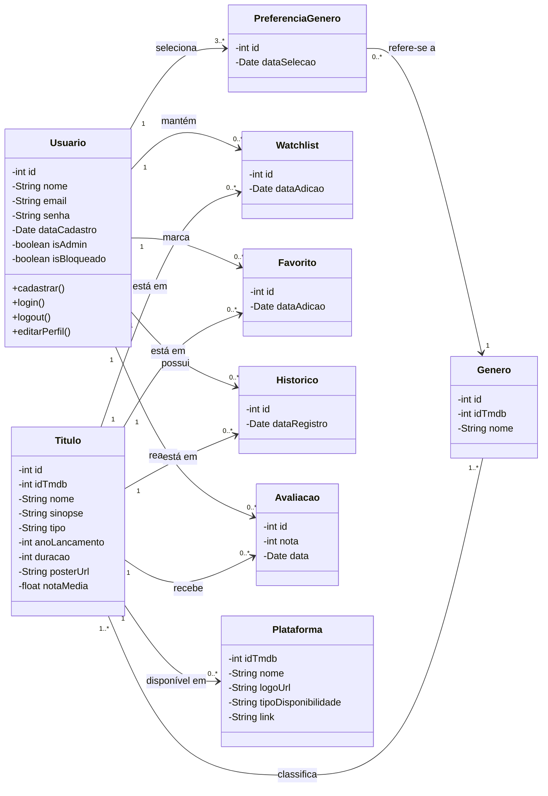

# 3. DOCUMENTO DE ESPECIFICAÇÃO DE REQUISITOS DE SOFTWARE

Constarão a seguir os detalhamentos dos requisitos do sistema.

## 3.1 Objetivos deste documento

Descrever e especificar as necessidades dos usuários que devem ser atendidas pelo projeto CineMatch - Sistema de Recomendação de Filmes e Séries.

## 3.2 Escopo do produto

### 3.2.1 Nome do produto e seus componentes principais

O produto será um Sistema de Recomendação de Filmes e Séries com o nome "CineMatch". Ele será composto por cinco componentes (módulos), com elementos necessários à gestão de catálogo, de usuário, de recomendações personalizadas, de watchlist/favoritos e de avaliações.

### 3.2.2 Missão do produto

Fornecer uma plataforma centralizada para busca, avaliação e recomendação personalizada de filmes e séries, permitindo que o usuário organize seu consumo audiovisual independentemente da plataforma de streaming utilizada.

### 3.2.3 Limites do produto

O CineMatch não realiza streaming de conteúdo audiovisual. O sistema não vende ou gerencia assinaturas de plataformas de streaming. O sistema não realiza curadoria editorial dos títulos, utilizando os dados disponibilizados pela API do TMDB (The Movie Database) como fonte de informação do catálogo.

### 3.2.4 Benefícios do produto

| # | Benefício | Valor para o Cliente |
|---|-----------|----------------------|
| 1 | Facilidade na busca de filmes e séries | Essencial |
| 2 | Recomendações personalizadas baseadas no perfil do usuário | Essencial |
| 3 | Organização de listas de títulos para assistir | Essencial |
| 4 | Segurança no cadastro de usuários | Essencial |

## 3.3 Descrição geral do produto

### 3.3.1 Requisitos Funcionais

| Código | Funcionalidade | Descrição |
|--------|---------------|-----------|
| RF1 | Cadastrar no Sistema | Processamento de cadastro de novo usuário com nome, e-mail, senha e seleção de gêneros preferidos (onboarding) |
| RF2 | Entrar no Sistema | Processamento de login de usuário cadastrado |
| RF3 | Sair do Sistema | Processamento de saída de usuário do sistema |
| RF4 | Gerenciar Perfil do Usuário | Processamento de Alteração e Consulta dos dados do perfil do usuário (nome, e-mail, senha) |
| RF5 | Gerenciar Preferências de Gênero | Processamento de Inclusão, Alteração e Exclusão dos gêneros preferidos do usuário, utilizados como base para as recomendações |
| RF6 | Buscar Filme/Série | Pesquisar filmes e séries no catálogo utilizando a API do TMDB, por título ou palavra-chave |
| RF7 | Filtrar Busca Avançada | Filtrar resultados de busca por gênero, ano de lançamento, tipo (filme ou série) e faixa de nota |
| RF8 | Visualizar Detalhes do Título | Exibir informações detalhadas de um filme ou série (sinopse, elenco, gênero, nota média, ano, duração, poster, etc.) |
| RF9 | Gerenciar Avaliação | Processamento de Inclusão, Alteração e Exclusão de avaliação (nota de 1 a 5 estrelas) de um título |
| RF10 | Gerar Recomendações por Preferências | Gerar lista de títulos recomendados com base nos gêneros preferidos do usuário, voltado para usuários novos ou com poucas avaliações (cold start) |
| RF11 | Gerar Recomendações por Avaliações | Gerar lista de títulos recomendados com base no histórico de avaliações do usuário, priorizando características (gêneros, tipo, ano) dos títulos bem avaliados (4-5 estrelas) e reduzindo peso dos mal avaliados (1-2 estrelas), utilizando filtragem baseada em conteúdo |
| RF12 | Gerenciar Watchlist | Processamento de Inclusão, Consulta e Exclusão de títulos na lista de "quero assistir" do usuário. A operação de Alteração não se aplica, pois cada item é uma associação simples entre usuário e título, sem atributos editáveis (modificações no conteúdo da lista são feitas via Inclusão/Exclusão). |
| RF13 | Gerenciar Favoritos | Processamento de Inclusão, Consulta e Exclusão de títulos marcados como favoritos pelo usuário. A operação de Alteração não se aplica, pois cada item é uma associação simples entre usuário e título, sem atributos editáveis. |
| RF14 | Gerenciar Histórico de Assistidos | Registro automático dos títulos avaliados pelo usuário como assistidos, com possibilidade de Consulta e Exclusão. As operações de Inclusão e Alteração não se aplicam ao usuário, pois o registro é criado automaticamente pelo Sistema ao gravar uma avaliação. |
| RF15 | Gerenciar Usuários | Processamento de Consulta, Bloqueio e Desbloqueio de usuários pelo Administrador do sistema. As operações de Inclusão e Exclusão de usuários não se aplicam ao Administrador (Inclusão é feita via auto-cadastro do Usuário Comum em RF1; remoções são tratadas via Bloqueio para preservar histórico de avaliações). |
| RF16 | Visualizar Disponibilidade em Plataformas | Exibir na tela de detalhes do título em quais plataformas de streaming ele está disponível (para assistir, alugar ou comprar), com link para a plataforma correspondente, utilizando os dados de Watch Providers da API do TMDB |

### 3.3.2 Requisitos Não Funcionais

| Código | Restrição | Descrição |
|--------|-----------|-----------|
| RNF1 | Ambiente | O sistema deverá funcionar nos navegadores Google Chrome, Mozilla Firefox, Microsoft Edge e Safari em suas versões mais recentes |
| RNF2 | Responsividade | O sistema deverá ser responsivo, adaptando-se a diferentes tamanhos de tela (desktop, tablet e smartphone) |
| RNF3 | Segurança | O produto deve restringir o acesso por meio de senhas individuais para o usuário |
| RNF4 | Disponibilidade | O sistema depende da disponibilidade da API do TMDB para exibição dos dados do catálogo de filmes e séries |

### 3.3.3 Usuários

| # | Ator | Definição |
|---|------|-----------|
| 1 | Administrador | Usuário gerente do sistema responsável pela gestão de usuários e manutenção da plataforma. Possui acesso geral ao sistema. |
| 2 | Usuário Comum | Usuário responsável por buscar títulos, avaliá-los, adicionar à watchlist, favoritar e receber recomendações personalizadas. |

Características dos usuários:

| # | Ator | Frequência de uso | Nível de instrução | Proficiência na aplicação | Proficiência em informática |
|---|------|-------------------|--------------------|--------------------------|-----------------------------|
| 1 | Administrador | Diária em qualquer horário | Indefinido | Sim | Sistema Operacional, Navegadores Web |
| 2 | Usuário Comum | Indefinida | Indefinido | Sim | Navegação Web básica |

## 3.4 Modelagem do Sistema

### 3.4.1 Diagrama de Casos de Uso

Para facilitar a leitura, o diagrama de casos de uso foi dividido em duas figuras: a Figura 1a apresenta os casos de uso do **Usuário Comum** e a Figura 1b apresenta os casos de uso do **Administrador**, que herda (generalização) todas as funcionalidades do Usuário Comum e ainda possui o caso de uso exclusivo de Gerenciar Usuários.

O Usuário Comum poderá cadastrar-se e entrar no sistema, buscar filmes e séries (com filtros avançados como extensão da busca), visualizar detalhes dos títulos e sua disponibilidade nas plataformas de streaming, avaliar títulos com nota em estrelas, receber recomendações personalizadas (por preferências de gênero ou por histórico de avaliações) e gerenciar sua watchlist, favoritos, histórico de assistidos e preferências de gênero. A **API TMDB** atua como ator secundário (sistema externo), sendo consultada pelos casos de uso de busca, detalhamento, recomendações e disponibilidade em plataformas. Estão modelados os relacionamentos UML de:

- **«extend»**: `Filtrar Busca Avançada` estende `Buscar Filme/Série`; `Visualizar Disponibilidade em Plataformas` estende `Visualizar Detalhes do Título` (comportamentos opcionais que ampliam um caso de uso base).
- **Generalização**: `Administrador` herda de `Usuário Comum` (o Administrador pode executar todos os casos de uso do Usuário Comum).

#### Figura 1a: Diagrama de Casos de Uso — Usuário Comum.

#### Figura 1b: Diagrama de Casos de Uso — Administrador.

O Administrador, por meio da relação de **generalização** com o Usuário Comum, herda todos os casos de uso da Figura 1a (em especial Entrar no Sistema e Sair do Sistema) e possui adicionalmente o caso de uso exclusivo de Gerenciar Usuários.

### 3.4.2 Descrições de Casos de Uso

#### Cadastrar no Sistema (CSU01)

Sumário: Um novo usuário realiza seu cadastro no sistema, informando seus dados e selecionando seus gêneros preferidos.

Ator Primário: Usuário Comum.

Ator Secundário: Não possui.

Pré-condições: O usuário não deve possuir cadastro prévio no sistema.

Fluxo Principal:

1) O usuário acessa a tela de cadastro.
2) O Sistema apresenta um formulário solicitando nome, e-mail e senha.
3) O usuário preenche os dados e confirma.
4) O Sistema verifica se o e-mail já está cadastrado. Se sim, reporta o fato e retorna ao passo 2; caso contrário, prossegue.
5) O Sistema apresenta a tela de onboarding com a lista de gêneros disponíveis (ação, comédia, drama, terror, ficção científica, romance, documentário, entre outros).
6) O usuário seleciona pelo menos 3 gêneros de sua preferência.
7) O Sistema grava o cadastro e as preferências de gênero do usuário.

Pós-condições: O usuário foi cadastrado no sistema com suas preferências iniciais de gênero, permitindo que o sistema gere recomendações desde o primeiro acesso.

#### Entrar no Sistema (CSU02)

Sumário: O usuário realiza o acesso ao sistema.

Ator Primário: Usuário Comum ou Administrador.

Ator Secundário: Não possui.

Pré-condições: Usuário deve estar cadastrado no sistema.

Fluxo Principal:

1) O usuário informa o e-mail e a senha.
2) O Sistema realiza a validação dos dados informados.
3) Se o usuário informou dados incorretos, o sistema apresenta mensagem de erro "E-mail ou senha incorretos" e o caso de uso retorna ao passo 1; caso contrário, o caso de uso termina.

Fluxo Alternativo (2): Usuário bloqueado

a) O Sistema identifica que o usuário está bloqueado.  
b) O Sistema apresenta a mensagem "Sua conta foi suspensa. Entre em contato com o administrador."  
c) O caso de uso termina.

Pós-condições: O usuário entra no sistema e tem acesso às suas informações e funcionalidades.

#### Sair do Sistema (CSU03)

Sumário: O usuário sai do sistema.

Ator Primário: Usuário Comum ou Administrador.

Ator Secundário: Não possui.

Pré-condições: Usuário deve estar logado no sistema.

Fluxo Principal:

1) O usuário acessa a função de saída.
2) O Sistema realiza o logout da conta.
3) O Sistema redireciona o usuário para a tela de login.

Pós-condições: O usuário saiu do sistema.

#### Gerenciar Perfil do Usuário (CSU04)

Sumário: O usuário comum realiza a gestão (alteração e consulta) dos dados do seu perfil.

Ator Primário: Usuário Comum.

Ator Secundário: Não possui.

Pré-condições: Usuário deve estar cadastrado e logado no sistema.

Fluxo Principal:

1) O usuário comum acessa a tela do seu perfil.
2) O Sistema apresenta os dados atuais do usuário (nome, e-mail) e as operações disponíveis: Alteração ou Consulta.
3) O usuário comum seleciona a operação desejada ou opta por finalizar o caso de uso.

Fluxo Alternativo (3): Alteração

a) O usuário comum altera um ou mais dados (nome, e-mail, senha) e requisita a atualização.  
b) O Sistema verifica a validade dos dados. Se válidos, atualiza o cadastro; caso contrário, reporta o erro.

Fluxo Alternativo (3): Consulta

a) O Sistema apresenta os dados do perfil do usuário, incluindo estatísticas como quantidade de avaliações, títulos na watchlist e nos favoritos.

Pós-condições: Os dados do perfil foram alterados ou apresentados na tela.

#### Gerenciar Preferências de Gênero (CSU05)

Sumário: O usuário comum realiza a gestão (inclusão, alteração e exclusão) dos seus gêneros preferidos, que são utilizados pelo sistema de recomendação. A operação de Alteração permite redefinir o conjunto inteiro de preferências em uma única ação.

Ator Primário: Usuário Comum.

Ator Secundário: Não possui.

Pré-condições: Usuário deve estar cadastrado e logado no sistema.

Fluxo Principal:

1) O usuário comum acessa a tela de preferências de gênero.
2) O Sistema apresenta a lista de gêneros disponíveis, com os gêneros já selecionados pelo usuário destacados.
3) O usuário comum seleciona a operação desejada: Inclusão, Alteração, Exclusão, ou opta por finalizar o caso de uso.

Fluxo Alternativo (3): Inclusão

a) O usuário comum seleciona um ou mais gêneros adicionais.  
b) O Sistema adiciona os gêneros às preferências do usuário e atualiza a lista.

Fluxo Alternativo (3): Alteração

a) O usuário comum redefine sua seleção de gêneros, marcando novos e desmarcando outros em uma única operação, e confirma.  
b) O Sistema verifica se a nova seleção contém pelo menos 3 gêneros. Se sim, substitui o conjunto anterior pelo novo conjunto de preferências; caso contrário, apresenta a mensagem "Você deve manter pelo menos 3 gêneros selecionados." e retorna ao passo 2.

Fluxo Alternativo (3): Exclusão

a) O usuário comum desmarca um ou mais gêneros previamente selecionados.  
b) O Sistema verifica se restam pelo menos 3 gêneros selecionados. Se sim, remove os gêneros desmarcados; caso contrário, apresenta a mensagem "Você deve manter pelo menos 3 gêneros selecionados."

Pós-condições: As preferências de gênero do usuário foram atualizadas, impactando as recomendações futuras.

#### Buscar Filme/Série (CSU06)

Sumário: O usuário comum realiza a busca de filmes e séries no catálogo.

Ator Primário: Usuário Comum.

Ator Secundário: API TMDB.

Pré-condições: Não possui.

Fluxo Principal:

1) O usuário comum acessa a funcionalidade de busca.
2) O Sistema apresenta um campo de pesquisa.
3) O usuário comum digita o termo de busca (título ou palavra-chave).
4) O Sistema consulta a API do TMDB e apresenta uma lista de resultados correspondentes, exibindo poster, nome, ano e nota média de cada título.
5) Se o usuário comum desejar refinar a busca, o caso de uso retorna ao passo 3; caso contrário, o caso de uso termina.

Fluxo Alternativo (4): Nenhum resultado encontrado

a) O Sistema não encontra títulos correspondentes à pesquisa.  
b) O Sistema apresenta a mensagem "Nenhum título encontrado para a busca realizada."  
c) O caso de uso retorna ao passo 2.

Pós-condições: Uma lista de filmes e/ou séries foi apresentada na tela.

#### Filtrar Busca Avançada (CSU07)

Sumário: O usuário comum aplica filtros avançados para refinar os resultados da busca.

Ator Primário: Usuário Comum.

Ator Secundário: API TMDB.

Pré-condições: Não possui.

Fluxo Principal:

1) O usuário comum acessa a funcionalidade de busca avançada.
2) O Sistema apresenta os filtros disponíveis: gênero, ano de lançamento, tipo (filme ou série) e faixa de nota.
3) O usuário comum seleciona um ou mais filtros e confirma.
4) O Sistema consulta a API do TMDB com os filtros aplicados e apresenta a lista de resultados filtrados.
5) Se o usuário comum desejar alterar os filtros, o caso de uso retorna ao passo 2; caso contrário, o caso de uso termina.

Pós-condições: Uma lista filtrada de filmes e/ou séries foi apresentada na tela.

#### Visualizar Detalhes do Título (CSU08)

Sumário: O usuário comum visualiza as informações detalhadas de um filme ou série.

Ator Primário: Usuário Comum.

Ator Secundário: API TMDB.

Pré-condições: Não possui.

Fluxo Principal:

1) O usuário comum seleciona um título a partir da lista de resultados de busca, da watchlist, dos favoritos, do histórico ou das recomendações.
2) O Sistema consulta a API do TMDB e apresenta os dados detalhados do título: sinopse, elenco, gênero(s), nota média, ano de lançamento, duração e poster.
3) O Sistema consulta os Watch Providers da API do TMDB e exibe em quais plataformas de streaming o título está disponível para assistir, alugar ou comprar, com os logos das plataformas e links de redirecionamento.
4) O Sistema exibe a avaliação do próprio usuário (caso já tenha avaliado) e a nota média das avaliações dos demais usuários do CineMatch.
5) O Sistema apresenta as opções de ação: avaliar, adicionar à watchlist, adicionar aos favoritos.

Pós-condições: Os dados detalhados do título e sua disponibilidade em plataformas foram apresentados na tela.

#### Gerenciar Avaliação (CSU09)

Sumário: O usuário comum realiza a gestão (inclusão, alteração e exclusão) de suas avaliações de filmes e séries, utilizando nota de 1 a 5 estrelas.

Ator Primário: Usuário Comum.

Ator Secundário: Não possui.

Pré-condições: Usuário deve estar cadastrado e logado no sistema.

Fluxo Principal:

1) O usuário comum acessa os detalhes de um título.
2) O usuário comum seleciona a opção de avaliação.
3) O usuário comum seleciona a operação desejada: Inclusão, Exclusão ou Alteração, ou opta por finalizar o caso de uso.

Fluxo Alternativo (3): Inclusão

a) O usuário comum seleciona uma nota de 1 a 5 estrelas para o título.  
b) O Sistema grava a avaliação, atualiza a nota média do título no CineMatch e registra automaticamente o título no histórico de assistidos do usuário.

Fluxo Alternativo (3): Exclusão

a) O usuário comum seleciona sua avaliação e requisita a remoção.  
b) O Sistema remove a avaliação e recalcula a nota média do título.

Fluxo Alternativo (3): Alteração

a) O usuário comum seleciona sua avaliação e altera a nota em estrelas.  
b) O Sistema atualiza a avaliação e recalcula a nota média do título.

Pós-condições: Uma avaliação foi inserida, removida ou alterada. O perfil de gosto do usuário foi atualizado, impactando as recomendações futuras baseadas em avaliações.

#### Gerar Recomendações por Preferências (CSU10)

Sumário: O sistema gera uma lista de recomendações para o usuário com base nos gêneros preferidos selecionados no cadastro ou nas configurações de preferência. Este mecanismo é utilizado principalmente para usuários novos ou com poucas avaliações (cold start).

Ator Primário: Usuário Comum.

Ator Secundário: API TMDB.

Pré-condições: Usuário deve estar cadastrado e logado no sistema. O usuário deve possuir pelo menos 3 gêneros preferidos selecionados.

Fluxo Principal:

1) O usuário comum acessa a seção de recomendações.
2) O Sistema identifica que o usuário possui menos de 5 avaliações registradas.
3) O Sistema consulta os gêneros preferidos do usuário e busca na API do TMDB títulos populares e bem avaliados desses gêneros.
4) O Sistema apresenta a lista de títulos recomendados com poster, nome, ano e nota, ordenados por popularidade dentro dos gêneros preferidos.
5) O usuário comum pode selecionar um título para visualizar seus detalhes.

Pós-condições: Uma lista de títulos recomendados com base nas preferências de gênero foi apresentada na tela.

#### Gerar Recomendações por Avaliações (CSU11)

Sumário: O sistema gera uma lista de recomendações personalizadas para o usuário com base no seu histórico de avaliações, utilizando filtragem baseada em conteúdo. O sistema analisa os gêneros, tipos e características dos títulos que o usuário avaliou positivamente (4-5 estrelas) e negativamente (1-2 estrelas) para construir um perfil de gosto e recomendar títulos similares aos preferidos.

Ator Primário: Usuário Comum.

Ator Secundário: API TMDB.

Pré-condições: Usuário deve estar cadastrado e logado no sistema. O usuário deve possuir pelo menos 5 avaliações registradas.

Fluxo Principal:

1) O usuário comum acessa a seção de recomendações.
2) O Sistema identifica que o usuário possui 5 ou mais avaliações registradas.
3) O Sistema analisa o histórico de avaliações do usuário e constrói um perfil de gosto:
   - Identifica os gêneros mais frequentes nos títulos avaliados com 4-5 estrelas (gêneros preferidos por comportamento).
   - Identifica os gêneros mais frequentes nos títulos avaliados com 1-2 estrelas (gêneros a evitar).
   - Considera o tipo preferido (filme, série ou ambos) e a faixa de ano de lançamento dos títulos bem avaliados.
4) O Sistema consulta a API do TMDB e filtra títulos que correspondam ao perfil de gosto do usuário, excluindo títulos já avaliados, já presentes na watchlist ou no histórico.
5) O Sistema apresenta a lista de títulos recomendados com poster, nome, ano e nota, ordenados por relevância ao perfil do usuário.
6) O usuário comum pode selecionar um título para visualizar seus detalhes.

Fluxo Alternativo (2): Transição de recomendação

a) O Sistema identifica que o usuário possui entre 5 e 10 avaliações.  
b) O Sistema gera recomendações combinando as preferências de gênero cadastradas (CSU10) com o perfil de avaliações, dando peso crescente às avaliações conforme o número delas aumenta.

Pós-condições: Uma lista de títulos recomendados com base no perfil de gosto derivado das avaliações foi apresentada na tela.

#### Gerenciar Watchlist (CSU12)

Sumário: O usuário comum realiza a gestão (inclusão, consulta e exclusão) de sua lista de títulos para assistir. **Observação:** a operação de Alteração não se aplica a este caso de uso, pois cada item da watchlist é uma associação simples entre usuário e título, sem atributos modificáveis pelo usuário; mudanças no conteúdo da lista são realizadas via Inclusão e Exclusão.

Ator Primário: Usuário Comum.

Ator Secundário: Não possui.

Pré-condições: Usuário deve estar cadastrado e logado no sistema.

Fluxo Principal:

1) O usuário comum requisita a gestão de sua watchlist.
2) O Sistema apresenta a lista de títulos adicionados à watchlist e as operações disponíveis: inclusão, exclusão e consulta.
3) O usuário comum seleciona a operação desejada: Inclusão, Exclusão ou Consulta, ou opta por finalizar o caso de uso.
4) Se o usuário comum desejar continuar com a gestão da watchlist, o caso de uso retorna ao passo 2; caso contrário, o caso de uso termina.

Fluxo Alternativo (3): Inclusão

a) O usuário comum, ao visualizar os detalhes de um título, clica no botão "Adicionar à Watchlist".  
b) O Sistema verifica se o título já está na watchlist. Se sim, apresenta a mensagem "Título já está na sua watchlist"; caso contrário, adiciona o título e exibe mensagem de confirmação.

Fluxo Alternativo (3): Exclusão

a) O usuário comum seleciona um título da watchlist e requisita a remoção.  
b) O Sistema realiza a remoção do título da watchlist.

Fluxo Alternativo (3): Consulta

a) O usuário comum acessa sua watchlist.  
b) O Sistema apresenta a lista de títulos salvos com poster, nome e ano.  
c) O usuário comum seleciona um título para visualizar seus detalhes.

Pós-condições: Um título foi inserido ou removido da watchlist, ou a lista foi apresentada na tela.

#### Gerenciar Favoritos (CSU13)

Sumário: O usuário comum realiza a gestão (inclusão, consulta e exclusão) de seus títulos favoritos. **Observação:** a operação de Alteração não se aplica a este caso de uso, pois cada item dos favoritos é uma associação simples entre usuário e título, sem atributos modificáveis pelo usuário; mudanças no conteúdo da lista são realizadas via Inclusão e Exclusão.

Ator Primário: Usuário Comum.

Ator Secundário: Não possui.

Pré-condições: Usuário deve estar cadastrado e logado no sistema.

Fluxo Principal:

1) O usuário comum requisita a gestão de seus favoritos.
2) O Sistema apresenta a lista de títulos marcados como favoritos e as operações disponíveis: inclusão, exclusão e consulta.
3) O usuário comum seleciona a operação desejada: Inclusão, Exclusão ou Consulta, ou opta por finalizar o caso de uso.
4) Se o usuário comum desejar continuar com a gestão de favoritos, o caso de uso retorna ao passo 2; caso contrário, o caso de uso termina.

Fluxo Alternativo (3): Inclusão

a) O usuário comum, ao visualizar os detalhes de um título, clica no botão "Favoritar".  
b) O Sistema marca o título como favorito e exibe mensagem de confirmação.

Fluxo Alternativo (3): Exclusão

a) O usuário comum seleciona um título favorito e requisita a remoção.  
b) O Sistema remove o título da lista de favoritos.

Fluxo Alternativo (3): Consulta

a) O usuário comum acessa sua lista de favoritos.  
b) O Sistema apresenta a lista de títulos favoritos com poster, nome e ano.  
c) O usuário comum seleciona um título para visualizar seus detalhes.

Pós-condições: Um título foi inserido ou removido dos favoritos, ou a lista foi apresentada na tela.

#### Gerenciar Histórico de Assistidos (CSU14)

Sumário: O usuário comum consulta e gerencia seu histórico de títulos assistidos, que é alimentado automaticamente ao realizar avaliações. **Observação:** as operações de Inclusão e Alteração não se aplicam ao usuário neste caso de uso — a Inclusão é executada automaticamente pelo Sistema ao gravar uma avaliação (ver CSU09) e o registro não possui atributos editáveis pelo usuário; restam apenas Consulta e Exclusão.

Ator Primário: Usuário Comum.

Ator Secundário: Não possui.

Pré-condições: Usuário deve estar cadastrado e logado no sistema.

Fluxo Principal:

1) O usuário comum acessa a tela de histórico de assistidos.
2) O Sistema apresenta a lista de títulos que o usuário já avaliou, ordenados por data de avaliação (mais recente primeiro), com poster, nome, ano e a nota atribuída.
3) O usuário comum seleciona a operação desejada: Consulta ou Exclusão, ou opta por finalizar o caso de uso.

Fluxo Alternativo (3): Consulta

a) O usuário comum seleciona um título do histórico.  
b) O Sistema apresenta os detalhes do título.

Fluxo Alternativo (3): Exclusão

a) O usuário comum seleciona um título e requisita a remoção do histórico.  
b) O Sistema remove o título do histórico de assistidos. A avaliação associada é mantida.

Pós-condições: O histórico de assistidos foi apresentado ou um título foi removido do histórico.

#### Gerenciar Usuários (CSU15)

Sumário: O Administrador realiza a gestão (consulta, bloqueio e desbloqueio) dos usuários comuns. **Observação:** as operações de Inclusão e Exclusão de usuários não se aplicam ao Administrador — a Inclusão é feita exclusivamente via auto-cadastro do Usuário Comum (CSU01) e remoções são tratadas via Bloqueio para preservar a integridade do histórico de avaliações.

Ator Primário: Administrador.

Ator Secundário: Não possui.

Pré-condições: Usuário deve estar cadastrado no sistema como Administrador.

Fluxo Principal:

1) O Administrador requisita a gestão de usuários.
2) O Sistema apresenta as operações que podem ser realizadas: consulta, bloqueio e desbloqueio de um usuário comum.
3) O Administrador seleciona a operação desejada: Consulta, Bloqueio ou Desbloqueio, ou opta por finalizar o caso de uso.
4) Se o Administrador desejar continuar com a gestão de usuários, o caso de uso retorna ao passo 2; caso contrário, o caso de uso termina.

Fluxo Alternativo (3): Consulta

a) O Administrador opta por pesquisar pelo nome ou e-mail e solicita a consulta sobre a lista de usuários.  
b) O Sistema apresenta uma lista de usuários.  
c) O Administrador seleciona um usuário.  
d) O Sistema apresenta os detalhes do usuário (nome, e-mail, data de cadastro, status, quantidade de avaliações).

Fluxo Alternativo (3): Bloqueio

a) O Administrador seleciona um usuário ativo e requisita ao Sistema que o bloqueie.  
b) O Sistema verifica se o usuário já está bloqueado. Se sim, apresenta a mensagem "Usuário já está bloqueado." e retorna ao passo 2; caso contrário, realiza o bloqueio do usuário, impedindo seu acesso ao sistema.

Fluxo Alternativo (3): Desbloqueio

a) O Administrador seleciona um usuário bloqueado e requisita ao Sistema que o desbloqueie.  
b) O Sistema verifica se o usuário está atualmente bloqueado. Se sim, remove o bloqueio e restaura o acesso do usuário ao sistema; caso contrário, apresenta a mensagem "Usuário não está bloqueado." e retorna ao passo 2.

Pós-condições: Um usuário foi consultado, bloqueado ou desbloqueado.

#### Visualizar Disponibilidade em Plataformas (CSU16)

Sumário: O usuário comum visualiza em quais plataformas de streaming um título está disponível para assistir, alugar ou comprar.

Ator Primário: Usuário Comum.

Ator Secundário: API TMDB.

Pré-condições: Não possui.

Fluxo Principal:

1) O usuário comum acessa os detalhes de um título.
2) O Sistema consulta o endpoint de Watch Providers da API do TMDB para o título selecionado, filtrado pelo país do usuário (Brasil).
3) O Sistema apresenta as plataformas de streaming disponíveis, separadas por categoria: assistir (assinatura), alugar e comprar, exibindo o logo de cada plataforma.
4) O usuário comum clica em uma plataforma.
5) O Sistema redireciona o usuário para a página do título na plataforma selecionada.

Fluxo Alternativo (2): Nenhuma plataforma disponível

a) O Sistema não encontra nenhuma plataforma de streaming com o título disponível no país do usuário.  
b) O Sistema apresenta a mensagem "Este título não está disponível em nenhuma plataforma de streaming no momento."

Pós-condições: As plataformas de streaming disponíveis para o título foram apresentadas na tela, com links de redirecionamento.

### 3.4.3 Diagrama de Classes

A Figura 2 mostra o diagrama de classes do CineMatch. Nesta modelagem, seguiram-se as seguintes regras de negócio:

Cada Usuário deve ter um único e-mail para acessar e identificá-lo no sistema, ele deve ter como atributos: nome, e-mail, senha, data de cadastro, status de administrador e status de bloqueio. Essa classe tem o papel de registrar os dados de identificação e acesso que servem de base para que o usuário possa buscar títulos, avaliá-los, adicioná-los à watchlist e aos favoritos, e receber recomendações personalizadas.

Cada Usuário possui um conjunto de Preferências de Gênero, selecionadas durante o cadastro (onboarding) e editáveis a qualquer momento. Essas preferências são utilizadas pelo mecanismo de recomendação, especialmente para usuários novos (cold start).

Uma Watchlist, uma lista de Favoritos e um Histórico de Assistidos pertencem a apenas um usuário, podendo estarem vazios ou conterem inúmeros títulos.

Cada Título representa um filme ou série obtido da API do TMDB, contendo como atributos: idTmdb, nome, sinopse, tipo (filme ou série), ano de lançamento, duração, poster e nota média. Um título está associado a um ou vários gêneros e pode possuir zero ou inúmeras avaliações.

Cada Avaliação deve ser realizada por um único usuário e estar vinculada a um único título, tendo como atributos: nota (1 a 5 estrelas) e data. Ao registrar uma avaliação, o título é automaticamente adicionado ao histórico de assistidos do usuário. O conjunto de avaliações de um usuário alimenta o mecanismo de recomendação baseada em conteúdo.

Cada Título pode estar disponível em zero ou várias Plataformas de streaming. A classe Plataforma representa os dados obtidos do endpoint Watch Providers da API do TMDB, contendo como atributos: nome da plataforma, logo e tipo de disponibilidade (assinatura, aluguel ou compra). Esses dados são consultados em tempo real e não são persistidos localmente.

**Observação sobre as classes Watchlist, Favorito e Histórico:** as três classes são entidades **independentes entre si**, sem relacionamento direto. Embora compartilhem estrutura semelhante (associando Usuário e Título com uma data), representam intenções distintas do usuário no sistema:

- **Watchlist**: títulos que o usuário marcou manualmente como "quero assistir".
- **Favorito**: títulos que o usuário marcou manualmente como preferidos.
- **Histórico**: registro automático, criado pelo Sistema sempre que o usuário avalia um título (CSU09), representando os títulos já assistidos.

A separação em três classes evita ambiguidade semântica e permite que cada lista evolua independentemente (por exemplo, um título pode estar simultaneamente na Watchlist e nos Favoritos sem estar no Histórico, caso o usuário ainda não o tenha avaliado).

**Observação sobre a associação Título–Gênero:** trata-se de uma associação muitos-para-muitos no nível conceitual (um título pertence a um ou mais gêneros e um gênero classifica vários títulos). Não foi modelada uma classe de associação separada, pois a relação não possui atributos próprios — a tabela de junção pertence ao modelo físico de banco de dados, não ao modelo conceitual de classes.

#### Figura 2: Diagrama de Classes do Sistema.

### 3.4.4 Descrições das Classes

| # | Nome | Descrição |
|---|------|-----------|
| 1 | Usuario | Gerenciar informações relativas aos Usuários, por exemplo, nome, e-mail, senha, isto é, de acesso e identificação. |
| 2 | Titulo | Armazenar informações dos filmes e séries obtidos da API do TMDB, por exemplo, nome, sinopse, tipo, ano de lançamento, duração e poster. |
| 3 | Genero | Classificar os Títulos de acordo com seu gênero: ação, comédia, drama, terror, ficção científica, romance, documentário, entre outros. |
| 4 | Avaliacao | Registrar as notas (1 a 5 estrelas) que os usuários atribuem aos títulos. O conjunto de avaliações alimenta o sistema de recomendação baseada em conteúdo. |
| 5 | Watchlist | Gerenciar dados relativos à lista de títulos que o usuário deseja assistir. É uma classe intermediária entre Usuario e Titulo. |
| 6 | Favorito | Gerenciar dados relativos à lista de títulos marcados como favoritos pelo usuário. É uma classe intermediária entre Usuario e Titulo. |
| 7 | Historico | Registrar os títulos que o usuário já assistiu, alimentado automaticamente ao realizar uma avaliação. É uma classe intermediária entre Usuario e Titulo. |
| 8 | PreferenciaGenero | Registrar os gêneros preferidos do usuário, selecionados no onboarding e editáveis a qualquer momento. É uma classe intermediária entre Usuario e Genero. Utilizada no mecanismo de recomendação por preferências (cold start). |
| 9 | Plataforma | Representar as plataformas de streaming onde um título está disponível (para assistir, alugar ou comprar). Dados obtidos em tempo real do endpoint Watch Providers da API do TMDB, sem persistência local. |
